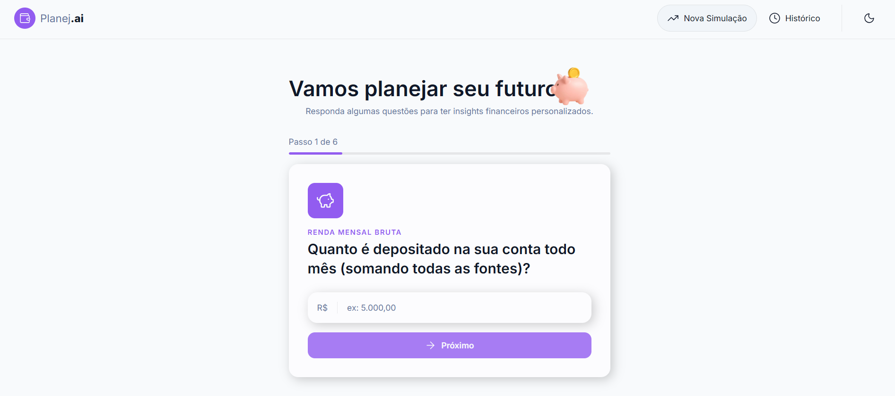
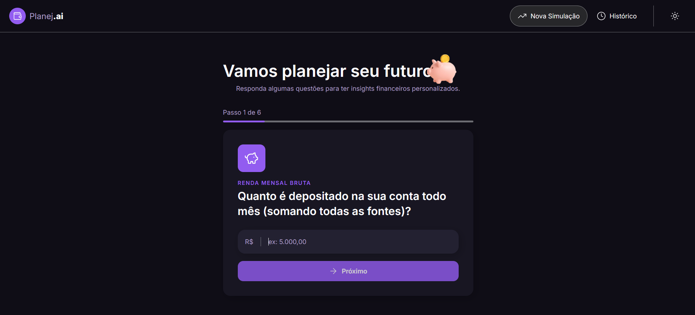
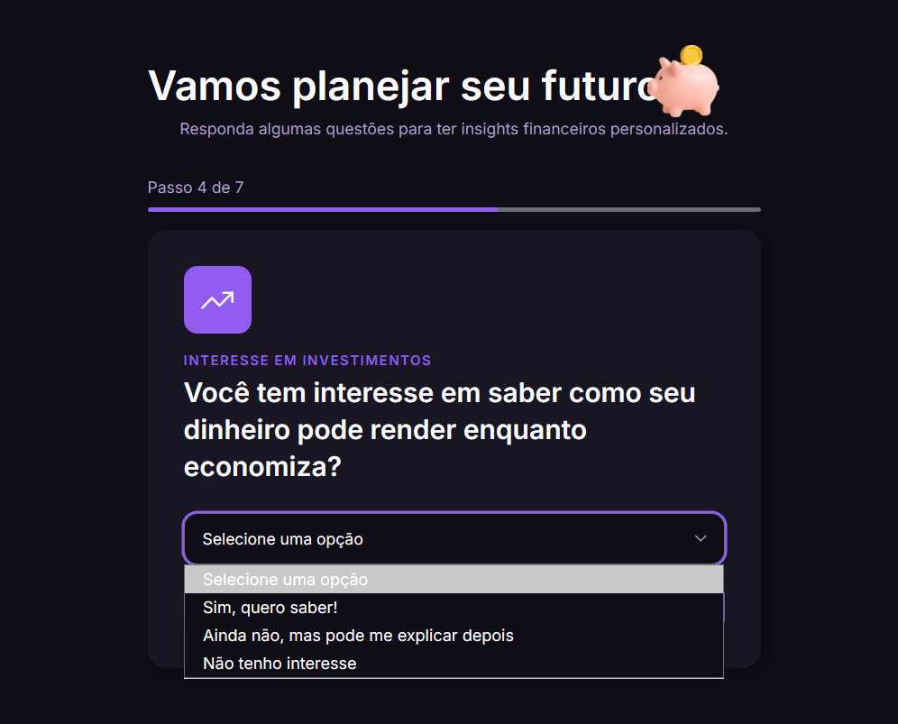
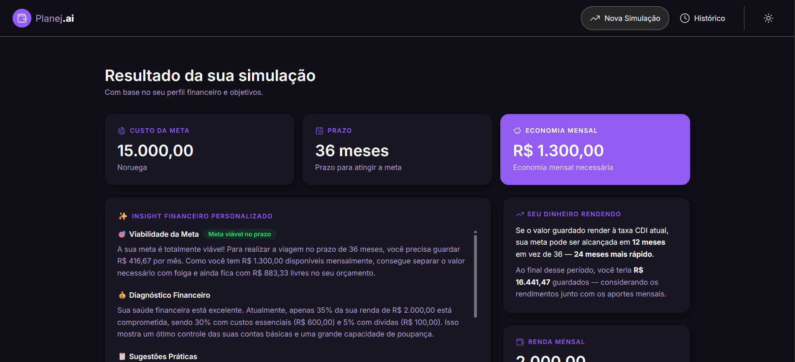
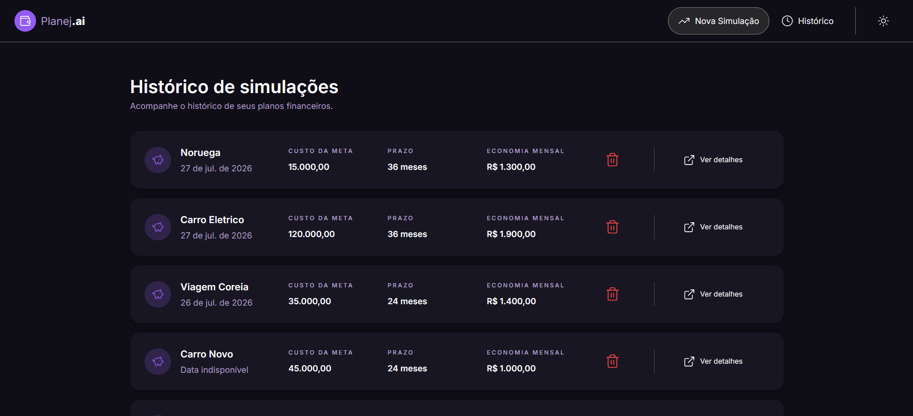
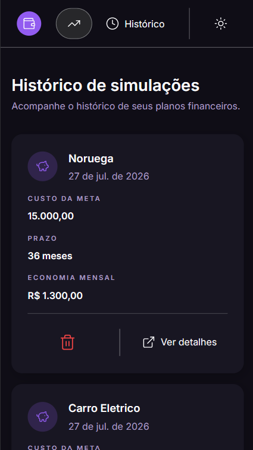

# Planej.ai 💰

Educador Financeiro Inteligente construído com **React**, **TypeScript** e **IA Generativa** (Google Gemini). A pessoa usuária preenche um formulário em etapas com renda, gastos e uma meta financeira, e recebe um diagnóstico personalizado — com sugestões práticas, análise de viabilidade e projeção de quanto tempo levaria para alcançar o objetivo investindo o dinheiro à taxa CDI atual.

Projeto desenvolvido como desafio final do bootcamp **"Desenvolvendo Seu Educador Financeiro Inteligente Com React E IA Generativa"** (DIO), a partir do [repositório base](https://github.com/digitalinnovationone/planejai).

## ✨ O que o projeto faz

1. A pessoa usuária responde um formulário em 7 etapas: renda mensal, custos fixos, dívidas, interesse em investimentos, nome da meta, custo da meta e prazo desejado.
2. Os dados são salvos no `localStorage` e um prompt estruturado é montado com base neles.
3. Esse prompt é enviado para a API do Gemini, que retorna um diagnóstico em JSON: viabilidade da meta, análise do comprometimento de renda, sugestões de economia, ideias de renda extra e uma mensagem motivacional.
4. O resultado é exibido numa página dedicada, com estados de carregamento e erro tratados.
5. A pessoa usuária pode tirar dúvidas adicionais com o Educador Financeiro através de um chat, e revisitar simulações anteriores numa página de histórico.

## 📸 Capturas de tela

**Formulário em etapas** — com tema claro e escuro:

<p>
  
  
</p>

Etapa com pergunta de múltipla escolha (interesse em investimentos):



**Resultado da simulação**, com o diagnóstico gerado pela IA e o card de projeção com a taxa CDI real:



**Histórico de simulações**:




## 🚀 Tecnologias usadas

- **React 19** + **TypeScript**
- **Vite** — build e dev server
- **Tailwind CSS v4** — estilização
- **React Router** — navegação entre páginas
- **Google Gemini API** — geração dos insights e das respostas do chat
- **API do Banco Central (BCB)** — taxa CDI mensal em tempo real
- **Context API** — tema claro/escuro
- **localStorage** — persistência de simulações e histórico de chat

## 🌟 Melhorias implementadas

Além da aplicação base, implementei três melhorias propostas como desafio final do bootcamp:

- **Histórico de simulações** (`/historico`): lista todas as simulações já feitas, ordenadas por data, com opção de revisitar o resultado ou excluir uma simulação.
- **Chat com o Educador Financeiro**: depois de ver o diagnóstico, a pessoa usuária pode fazer perguntas de acompanhamento sobre o próprio plano, com o histórico da conversa persistido por simulação.
- **Projeção de investimento com CDI real**: um card no resultado busca a taxa CDI mensal atual direto da API do Banco Central e calcula quanto tempo a meta levaria para ser alcançada se o dinheiro guardado rendesse nessa taxa, mostrando também o valor final acumulado.

## 🔧 Como executar a aplicação

Pré-requisitos: Node.js 18+ e [pnpm](https://pnpm.io/).

```bash
# 1. Clone o repositório
git clone https://github.com/giovannaizac/planejai.git
cd planejai

# 2. Instale as dependências
pnpm install

# 3. Configure a chave da API do Gemini
cp .env.example .env
# edite o .env e cole sua chave (gere uma em https://aistudio.google.com/app/apikey)

# 4. Rode o projeto
pnpm dev
```

A aplicação sobe em `http://localhost:5173`.

## 🧪 Como testar o fluxo principal

1. Acesse a página inicial e preencha o formulário em etapas (renda, gastos, dívidas, interesse em investimentos, meta, custo e prazo).
2. Ao concluir, você será redirecionado para a página de resultado, que vai carregar o diagnóstico gerado pela IA.
3. Veja o card de projeção com CDI logo abaixo do diagnóstico.
4. Use o chat para fazer uma pergunta sobre o plano gerado.
5. Acesse `/historico` para ver a simulação salva e testar a exclusão.
6. Use o botão de tema no cabeçalho para alternar entre claro e escuro.

## 📚 O que aprendi

Esse foi meu primeiro contato com React, com integração de API e com IA generativa — antes do bootcamp eu nunca tinha trabalhado com nenhum dos três. Nas primeiras semanas tive bastante dificuldade: conceitos como estado, hooks e requisições assíncronas pareciam abstratos demais, e eu não conseguia visualizar como as peças se encaixavam. O ponto de virada foi quando comecei a implementar o fluxo de ponta a ponta — formulário, prompt pra IA, resposta em JSON, exibição do resultado — e, ao ver os dados se movendo entre essas camadas, tudo começou a fazer sentido de verdade. Terminar esse projeto entendendo React e consumo de API do zero foi a maior prova de que consigo aprender tecnologias novas, mesmo começando sem nenhuma base.

## 📁 Estrutura do projeto

```
src/
├── components/       # Componentes reutilizáveis (features, layout, shared)
├── context/theme/    # Provider e context do tema claro/escuro
├── data/             # Modelo do formulário e construção dos prompts de IA
├── hooks/            # Hooks customizados (storage, insight, chat, projeção)
├── pages/            # Páginas (formulário, resultado, histórico)
├── Service/          # Integrações externas (Gemini e Banco Central)
└── utils/            # Funções auxiliares (moeda, cálculos de simulação)
```
